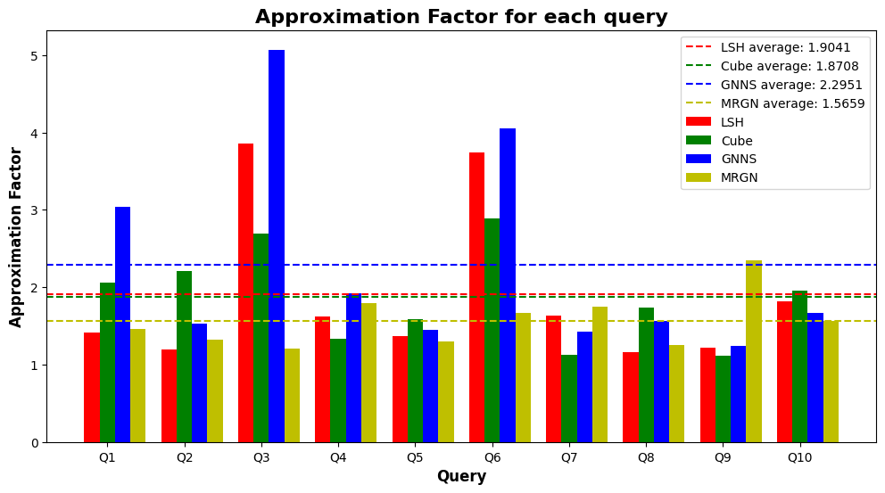
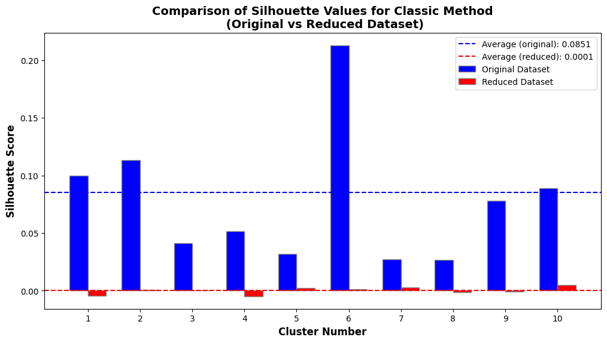
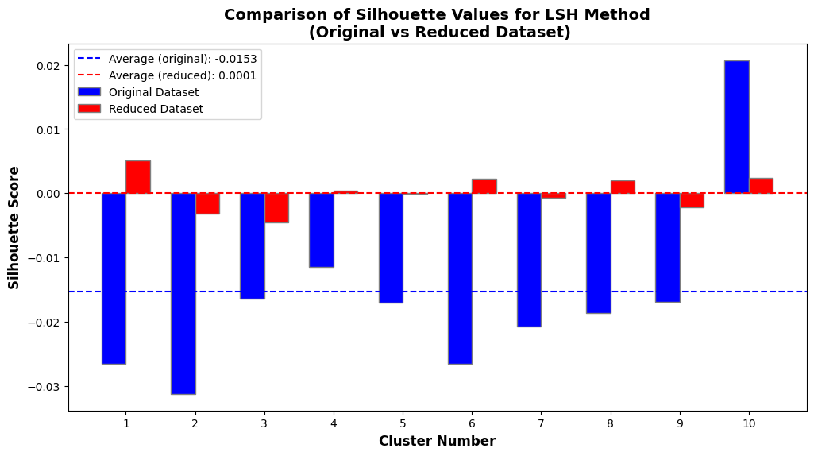
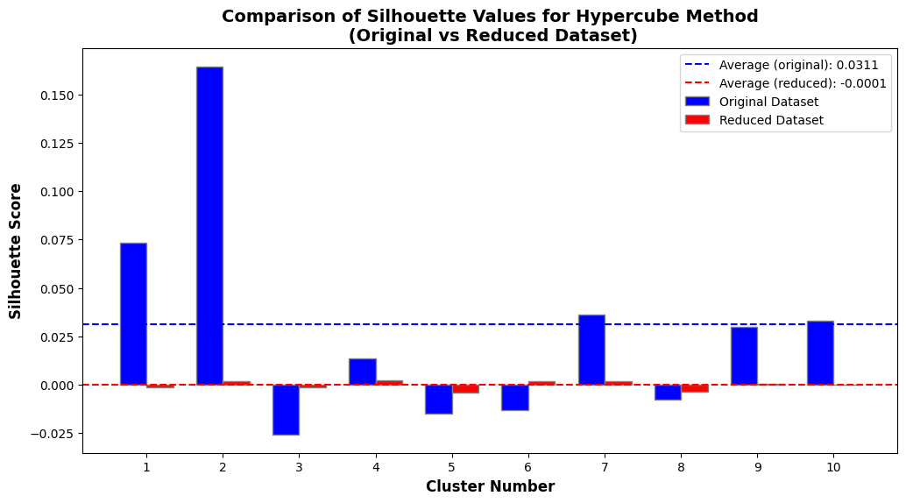
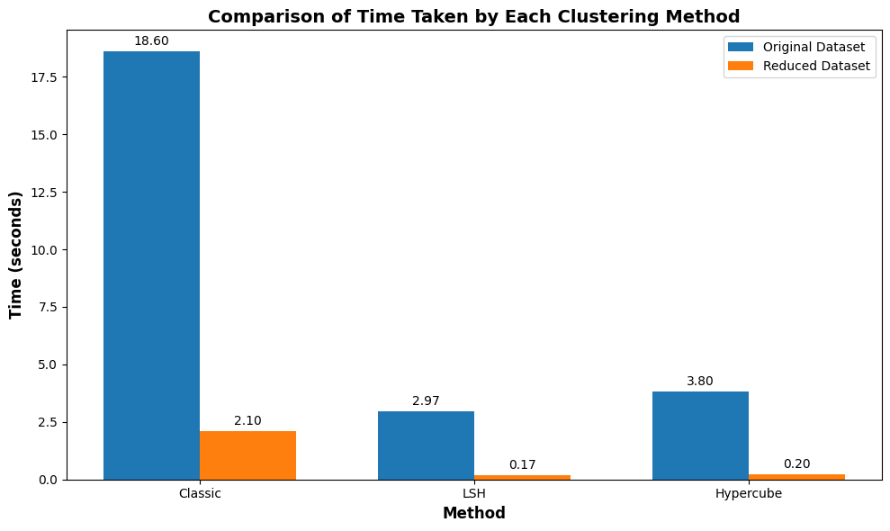
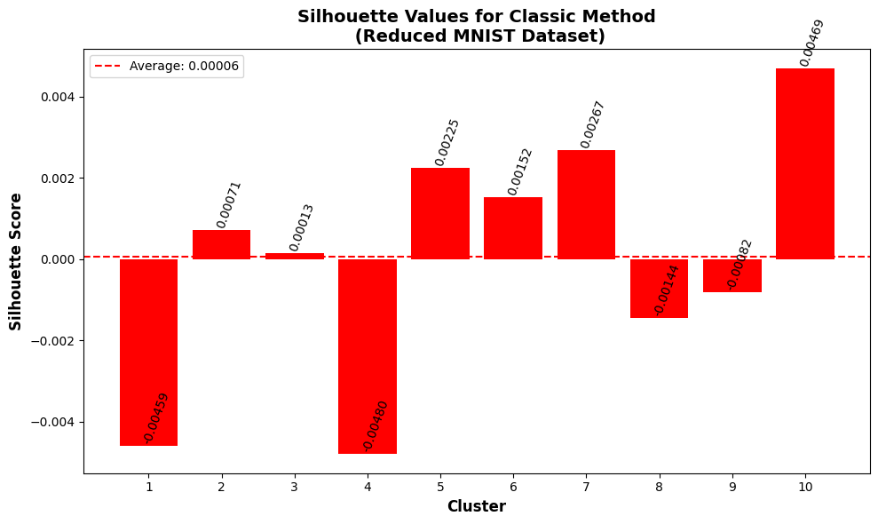
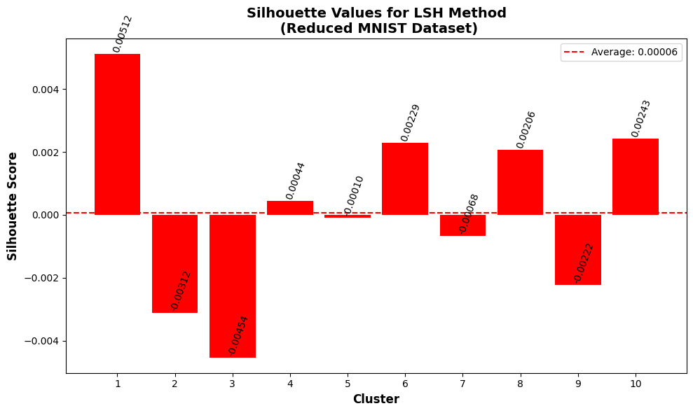
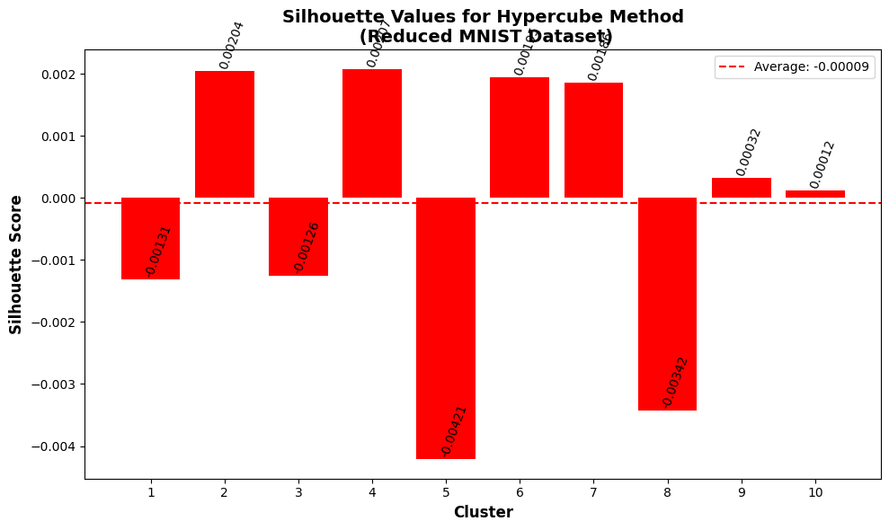

# Software Development for Algorithmic Problems (part 3)
### Kammas Zisis - sdi2000290
### Fotopoulos Dimitrios - sdi2000292
---
# Εκπαίδευση του μοντέλου 
Για να βρεθεί ένα αποτελεσματικό μοντέλο χρησιμοποιήθηκε η βιβλιοθήκη keras-tuner. Ο τρόπος που καταλήξαμε στο μοντέλο φαίνεται στο αρχείο **kerastuner.ipynb**. Οι λεπτομέρειες του μοντέλου και οι παράμετροι παρουσιάζονται παρακάτω:

## Autoencoder Results 

### best_model.h5
**Model Summary:**
- Model: "sequential_4"
- Total params: 1,692,078
- Trainable params: 1,692,078
- Non-trainable params: 0

**Configuration:**
- Optimizer: RMSprop (learning rate: 0.001)
- Loss Function: mean_squared_error
- Epochs: 10
- Batch Size: 32 (keras tuner default)

**Model Architecture:**
- Number of Layers: 14
- Convolutional Filter Sizes: [3x3, 3x3, 3x3]
- Number of Convolutional Filters per Layer: [224, 224, 224]
- Latent Dimension Size: 30

**Performance:**
Score:  Val loss: 0.006683

# 
# reduce.py
**κλήση**:
```
$python reduce.py -en <encoder_file> -od <output_dataset_file> -oq <output_queryset_file>
```
Το MNIST dataset φορτώνεται κατευθείαν από το keras, και δεν χρειάζεται να δωθεί σαν όρισμα κάποιο αρχείο. Δίνεται μόνο το όνομα του αρχείου που είναι αποθηκευμένος ο autoencoder (υποχρεωτικό) και τα ονόματα των αρχείων που θα δημιουργηθούν για να αποθηκευτούν τα datasets με μειωμένες διαστάσεις (προαιρετικά).

Με χρήση της συνάρτησης Model() της βιβλιοθήκης *tensorflow.keras* φορτώνεται μόνο το ***encoder part*** από το μοντέλο. Αφού παραχθούν τα νέα datasets, χρησιμοποιούμε μια βοηθητική συνάρτηση write_to_binary(), η οποία αποθηκεύει τα datasets σε ένα binary αρχείο με τη μορφή που έχει τo αρχείο που χρησιμοποιούσαμε στις προηγούμενες 2 εργασίες. Με αυτό τον τρόπο, πετυχαίνουμε η συνάρτηση που χρησιμοποιούσαμε σε γλώσσα c++ για να διαβάζει το dataset, να μπορεί να διαβάσει και τα νέα reduced datasets χωρίς τροποποίηση.


# Ερώτημα Β. 
Όλοι οι αλγόριθμοι δοκιμάστηκαν με τις 10 πρώτες εικόνες από το test dataset του MNIST. Στο αρχείο **OutcomeReadMe.md** υπάρχουν πίνακες για κάθε μέθοδο, όπου γίνεται σύγκριση των αποτελεσμάτων με το κλάσμα προσέγγισης (Approximation Factor). Στο παρακάτω διάγραμμα παρουσιάζονται τα κλάσματα προσέγγισης για κάθε query και κάθε μέθοδο. Δημιουργήθηκε στο αρχείο AF_visualization.ipynb. Τα αποτελέσματα κάθε μεθόδου ξεχωριστά υπάρχουν στον φάκελο **ResultFiles**.



# Ερώτημα Γ.
Για το clustering χρησιμοποιήθηκε το query set (10.000 εικόνες). Ολοι οι αλγόριθμοι (Classic method, LSH, Hypercube) δοκιμάστηκαν με το αρχικό query set και το reduced query set, και αξιολογήθηκαν με τον υπολογισμό του silhouette score για κάθε cluster, καθώς και τον χρόνο. Τα παρακάτω διαγράμματα δημιουργήθηκαν στο αρχείο **silhouettes_visualization.ipynb**. Περισσότερες λεπτομέρειες των αποτελεσμάτων υπάρχουν στο αρχείο **/ResultFiles/clustering_results_full.txt**.

## Classic method comparison

-
## LSH method comparison

-
## Hypercube method comparison

-
## Times comparison
 
-
## Classic method Reduced Dataset Scores

-
## LSH method Scores

-
## Hypercube method Scores
